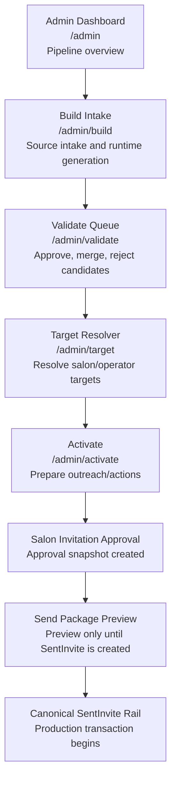

# VMB Admin Pipeline Map

## Purpose
This map separates admin/back-office work from the client-facing money rail.

## Admin Pipeline

## Admin vs Money Rail
Admin approval is not the transaction.

A send package preview is not the transaction.

The transaction begins only when `/api/vmb/sent-invites` creates a canonical `SentInvite`.

## Risk Boundary
Legacy/generated/runtime artifacts can support sourcing, enrichment, preview, and reconciliation, but they must not own claim or redemption state.
