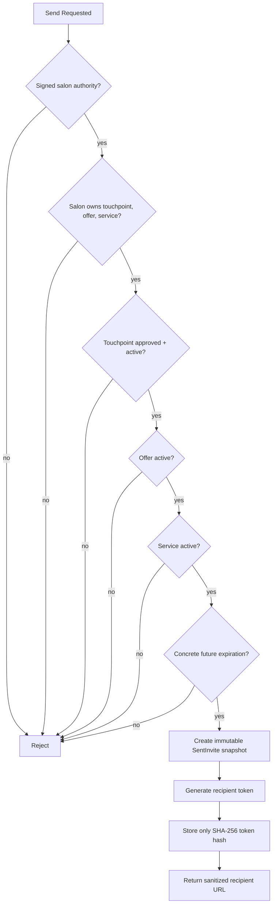
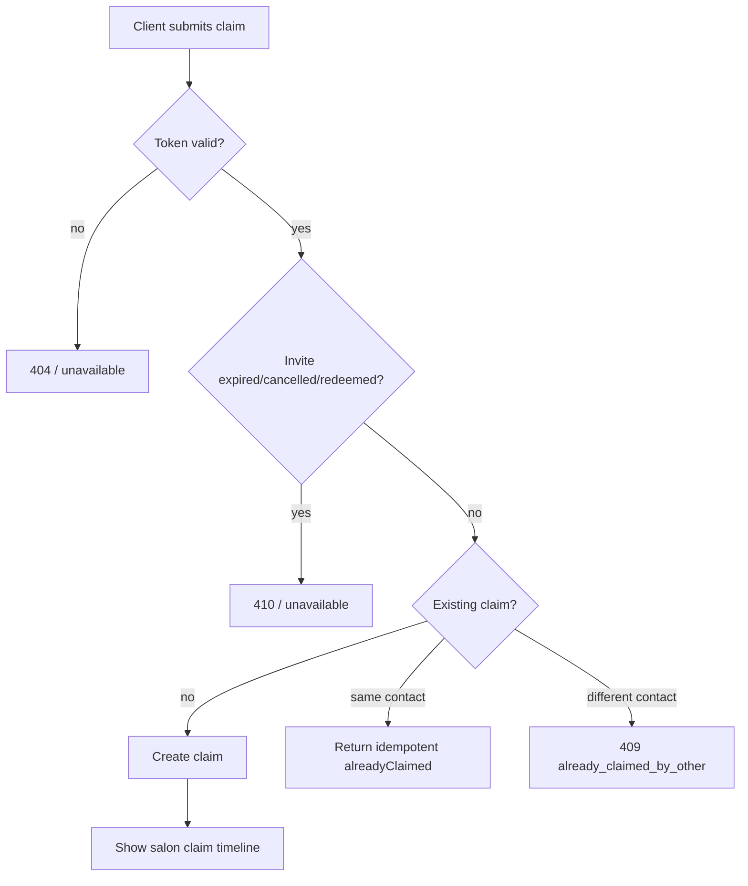

# VMB Send → Claim → Redemption Rail

## Purpose
This is the canonical MVP money rail.

## Technical Flow

```mermaid
flowchart TD
  A[UI: SendPackagePreviewModal] --> B[API: POST /api/vmb/sent-invites]
  B --> C[Domain: create-sent-invite.ts]
  C --> D[Authority: salon-authority.ts]
  C --> E[Eligibility Checks\napproved invitation\nactive touchpoint\nactive offer\nactive service\nsalon ownership\nfuture expiration]
  E --> F[Store: sent-invite-store.ts\nCreate SentInvite + token hash]
  F --> G[DTO: sent-invite-dto.ts\nSanitized response]
  G --> H[Public URL: /vmb/invite/{token}]
  H --> I[Public Page: app/vmb/invite/[inviteId]/page.tsx]
  I --> J[Domain: resolve-recipient-invite.ts]
  J --> K[Store: markSentInviteOpened]
  K --> L[API: POST /api/vmb/invite-claims]
  L --> M[Domain: submit-invite-claim.ts]
  M --> N[Store: claimSentInvite]
  N --> O[UI: SalonClaimsTimeline]
  O --> P[API: POST /api/vmb/sent-invites/[sentInviteId]/redeem]
  P --> Q[Store: redeemSentInvite]
  Q --> R[State: redeemed / closed]
```

## Canonical States

```text
draft → approved → sent → opened → claimed → redeemed
                     ↘ expired
                     ↘ cancelled
```

## Required Gates



## Claim Rules



## Money Rail Contract
Nothing client-facing exists until `SentInvite` exists.

Nothing claimable exists without a token.

Nothing mutable changes sent offer terms.

Nothing redeemed remains publicly available.
