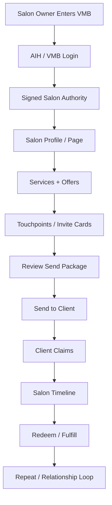

# VMB Salon Lifecycle Map

## Purpose
This document explains the salon owner's lifecycle from onboarding through active client growth.

## Salon Owner Lifecycle



## Key Owner Actions
- Confirm salon identity.
- Review active offers/services.
- Select approved touchpoint.
- Review send package.
- Send invite.
- Monitor claims.
- Redeem when fulfilled.

## Current MVP Edge
The product does not need full scheduling/payment integration to prove value.

The MVP proof is:

```text
Can the salon owner send a trusted offer that a real client can claim?
```

That rail now exists.
