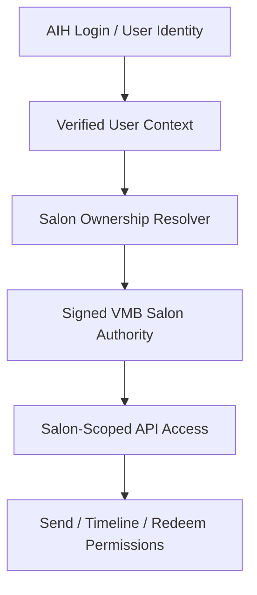

# AIH / VMB Authority Model

## Purpose
This document explains the current identity-to-salon authority bridge.

## Authority Flow

## Authority Rules
- Do not trust plain salon IDs from body, query, or unsigned cookies.
- Salon-scoped APIs must derive authority from signed/verifiable context.
- Cross-salon send, list, claim visibility, and redeem actions must be rejected.
- Old unsigned sessions are intentionally invalid after the signed-authority patch.

## MVP Rule
A salon owner can only create, view, and redeem invites for salons they are authorized to operate.
