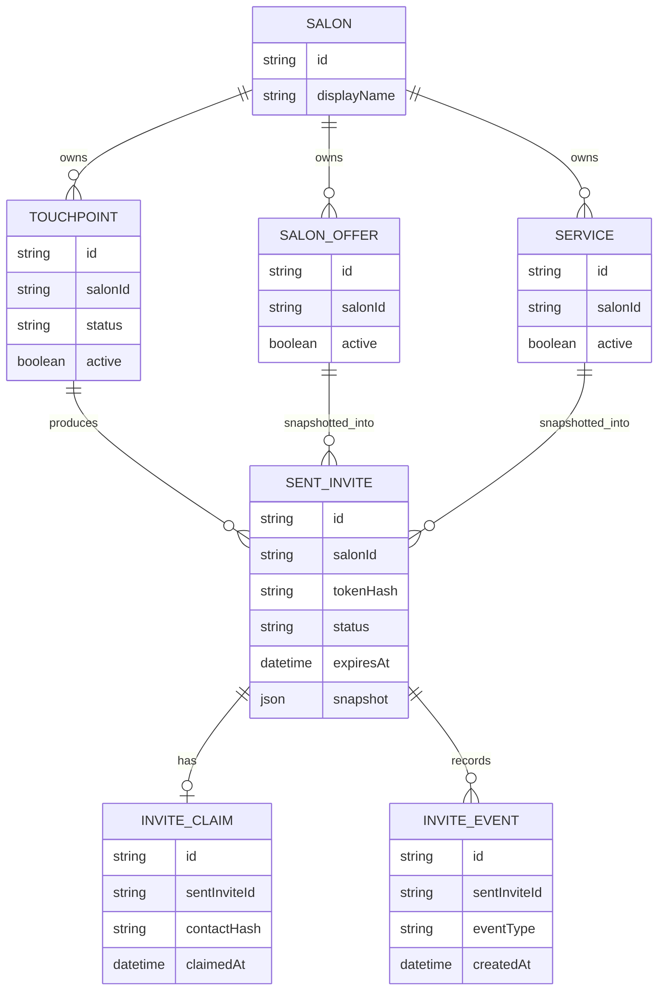

# VMB MVP Data Map

## Purpose
This map identifies the core data objects used by the MVP send/claim rail.

## Core Objects

## Persistence Rule
Production money-state mutations require Postgres.

JSON/in-memory fallback may exist for non-production tests, but not for Vercel production money state.
