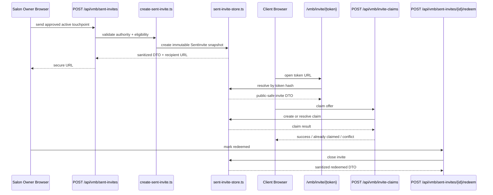

# VMB MVP API Map

## Purpose
This document maps the production-relevant API surface for the send/claim rail.

## API Flow

## Response Safety
Salon/browser responses must not include:

- `tokenHash`
- raw token
- raw DB rows
- internal salon IDs in public payloads
- source approval IDs
- source copy IDs
- internal catalog/admin metadata
- mutable raw snapshot internals

## Endpoint Ownership
- Send: salon-authorized only.
- Timeline/list: salon-authorized only.
- Redeem: salon-authorized only.
- Public invite page: token-only.
- Claim: token-bound, contact-aware.
