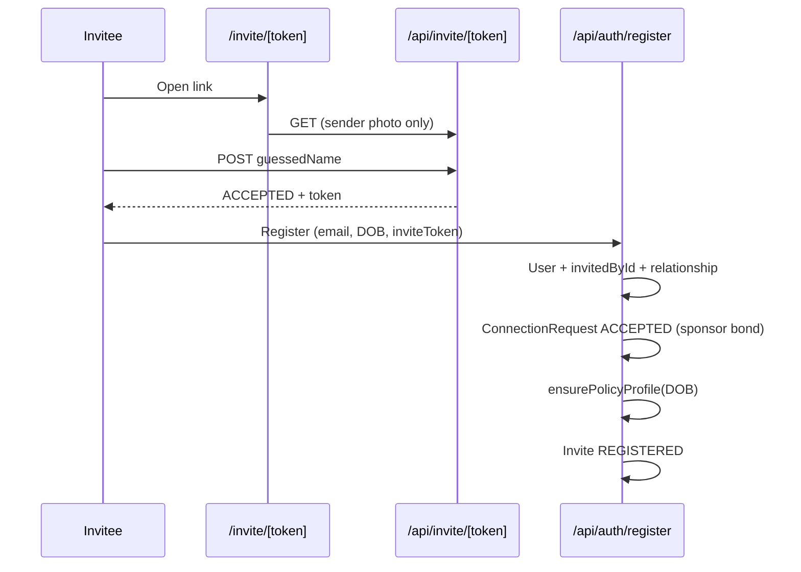

# Agent 72 — Invite Intent / Founder Assignment Logic Audit

**Branch:** `aihsafe-agent-72-invite-intent-founder-audit`  
**Date:** 2026-05-19  
**Scope:** Read-only audit. No product code, schema, API, or UI changes.

---

## Executive summary

The platform has **one generic invite pipeline** (`Invite` table + identity challenge + registration) with an optional **social relationship tag** (`relationship` string). There is **no `inviteIntent`, age bracket on the invite, steward declaration, or business/org role** stored on invites.

**Inviter never becomes Family Safe “founder” for the invitee** except the bootstrap case (first user in the database gets `User.role = "founder"`). Invite acceptance creates:

- `User.invitedById` → sponsor tree placement  
- `User.relationship` → copy of invite tag (semantic overload: not always “to founder”)  
- `ConnectionRequest` ACCEPTED → sponsor bond  
- `AihPolicyProfile` from DOB at registration (minor defaults apply if DOB proves child/teen)  

**Guardian links, family units, and trust-unit membership are not created by invite acceptance.** Child governance escalation exists only on `POST /api/aihsafe/invites` when a **minor target** is detected; the legacy `POST /api/invite` path has no minor gate.

The three example scenarios in the mission are **not modeled end-to-end today**:

| Scenario | Today |
|----------|--------|
| Adult friend (Spencer → Bill) | Sponsor bond + tree link only ✓ (no founder) |
| Child family (Spencer parent → Jane 12) | No auto guardian link; no steward assignment; child policy only if DOB entered at register |
| Business (CEO → CFO) | Same invite; trust units support `BUSINESS` vault type but invite does not assign org role |

---

## 1. Files inspected

### Invite creation & core lib

| Path | Role |
|------|------|
| `prisma/schema.prisma` | `Invite`, `User`, `ConnectionRequest`, `AihGuardianRelationship`, `AihFamilyUnit`, `TrustUnit`, `AihFounderSettings` |
| `lib/invite/index.ts` | `createInvite`, identity challenge |
| `app/api/invite/route.ts` | Legacy send/list; `VALID_RELATIONSHIPS`; auto trust-unit proposal |
| `app/api/invite/[token]/route.ts` | Challenge GET/POST |
| `app/api/invite/lookup/route.ts` | Email lookup |
| `app/api/invite/manage/[id]/route.ts` | Cancel/revoke |
| `lib/invite/sentForSender.ts` | Sent invite enrichment |
| `lib/trust/tuProposal.ts` | `tryAutoTrustUnitAfterInvite`, `resolveTrustUnitPendingInvitesOnRegister` |

### AIH Safe invites & governance

| Path | Role |
|------|------|
| `app/api/aihsafe/invites/route.ts` | TU/family-scoped invite + minor escalation |
| `lib/aihsafe/invites/index.ts` | `sendChildInvite`, guardian approve/decline (service layer) |
| `lib/aihsafe/governance/index.ts` | `canInviteToTrustUnit` |
| `lib/aihsafe/approvals/executeDeferredAction.ts` | Post-approval `invite_member` |
| `lib/aihsafe/approvals/selectApprovalRecipients.ts` | Guardian fan-out |
| `lib/aihsafe/context/buildActorContext.ts` | Memberships + guardian edges |
| `lib/aihsafe/policy/resolvePolicyProfile.ts` | Post-register policy |
| `types/aihsafe/invite-states.ts` | Domain invite states |
| `types/aihsafe/dto.ts` | `InviteMemberRequest`, DTOs |
| `types/aihsafe/age-tiers.ts` | Age tiers |
| `types/aihsafe/governance.ts` | `TargetContext` |

### Acceptance & registration

| Path | Role |
|------|------|
| `app/invite/[token]/page.tsx` | Identity challenge UI |
| `app/api/auth/register/route.ts` | Account creation, bond, policy profile |
| `app/(auth)/register` (referenced) | Registration form + DOB |

### UI (read-only)

| Path | Role |
|------|------|
| `app/(app)/invite/InviteClient.tsx` | Relationship picker; `POST /api/invite` |
| `components/invite/TrustUnitModal.tsx` | Trust unit formation from dashboard |
| `components/dashboard/*` | Invite list links to `/invite` |
| `components/aihsafe/people/GuardianLinkModal.tsx` | Manual guardian links (post-hoc) |
| `components/aihsafe/roles/shellMode.ts` | Founder shell vs member vs child UI |

### Reference / QA

| Path | Role |
|------|------|
| `docs/aihsafe/agent-70-visible-settings-qa-report.md` | Visible governance QA |
| `scripts/aihsafe/seed-relationship-scenarios.ts` | Manual seed of guardian/TU (not invite-driven) |

---

## 2. Current invite fields & creation

### `Invite` model (Prisma)

| Field | Purpose |
|-------|---------|
| `id`, `token` | Identity |
| `senderId` | Inviter |
| `recipientEmail` | Invitee (normalized lowercase) |
| `status` | `PENDING` → `ACCEPTED` → `REGISTERED` \| `EXPIRED` \| `CANCELLED` |
| `attempts`, `maxAttempts` | Identity challenge |
| `relationship` | Optional tag: `parent`, `child`, `sibling`, `spouse`, `so`, `frnd`, `other` |
| `expiresAt`, `acceptedAt`, `createdAt` | Lifecycle |

**Absent:** `inviteIntent`, `inviteeAgeBracket`, `targetTrustUnitId`, `familyUnitId`, `sponsorUserId`, `stewardUserId`, `organizationRole`, `childGuardianDeclaration`, `declaredAt`.

### Creation paths

| Route | Who | Notes |
|-------|-----|-------|
| `POST /api/invite` | Any authenticated user | Requires `relationship` enum; blocks existing members; calls `tryAutoTrustUnitAfterInvite` (3–20 member TU **proposal**, not family founder) |
| `POST /api/aihsafe/invites` | Authenticated + governance | Requires `trustUnitId` and/or `familyUnitId`; `targetAgeTier` hint; minor → `AihApprovalRequest` before `createInvite` |
| `lib/aihsafe/invites.sendChildInvite` | Programmatic | Guardian approval queue only; no `Invite` until approved |

`createInvite()` only persists: sender, email, relationship, token, expiry.

### Relationship tag semantics

- Stored on **Invite** and copied to **`User.relationship`** at registration.  
- Comment on `User.relationship` says “relationship to founder” but code treats it as **“how the sender labeled the connection”** (includes `frnd`, `child`, etc.).  
- **Not validated** against inviter/recipient roles (e.g. inviter can tag `parent` without being guardian).

### Age / minor handling at send time

| Path | Minor detection |
|------|-----------------|
| `POST /api/invite` | **None** |
| `POST /api/aihsafe/invites` | `deriveAgeTier(targetUser.dateOfBirth)` if account exists; else client `targetAgeTier` **only if** it is CHILD/PRETEEN/TEEN (adult hints discarded) |

`trustUnitId` / `familyUnitId` on AIH invite API are used for **governance context and audit** only — they are **not written** to the `Invite` row. Post-registration TU slot resolution uses `TrustUnitRequestPendingInvite` from the **legacy** `POST /api/invite` auto-proposal path, not from AIH invite metadata.

---

## 3. Current acceptance behavior

### Flow

### On successful registration (invite path)

| Effect | Created? |
|--------|----------|
| `User.invitedById = invite.senderId` | Yes |
| `User.relationship = invite.relationship` | Yes |
| `User.role` | `founder` only if **first user in DB**; else `member` |
| Sponsor `ConnectionRequest` ACCEPTED | Yes (if both human-trust-eligible) |
| `AihGuardianRelationship` | **No** |
| `AihFamilyUnit` / `TrustUnitMember` | **No** (except TU proposal slot if legacy auto-TU ran) |
| `AihFounderSettings.founderUserId` | **No** |
| Site admin (`role` admin) | **No** |

### Child/teen after register

- **Policy:** `ensurePolicyProfile(userId, dateOfBirth)` applies age-tier defaults (child posting limits, etc.).  
- **Family Safe shell:** `deriveShellMode()` → `child` if DOB yields minor tier.  
- **Guardian:** Must be created separately via `POST /api/aihsafe/guardian-links` (manual).  
- **Inviter as parent:** Tag `relationship: "parent"` does **not** create guardian link or steward rights.

### Pre-registration minor invite (AIH path)

- Adult invites minor (known or hinted) → approval request to minor’s **existing** guardians (`selectApprovalRecipients`).  
- On approve → `executeDeferredAction` `invite_member` creates `Invite` row (same as legacy).  
- Still **no** guardian link from inviter to future child account until explicit link API after child registers.

---

## 4. Current founder / steward assignment

### Site-level `User.role`

| Value | How assigned |
|-------|----------------|
| `founder` | First registered user **or** admin tooling |
| `admin` | Admin promotion |
| `member` | Default for all invite registrations |

**Inviter is never promoted to founder because someone accepted an invite.**

### Family Safe “founder” / steward (UI + settings)

| Concept | Implementation |
|---------|----------------|
| Governance shell | `User.role === "founder" \| "admin"` → `deriveShellMode` → `"founder"` |
| Network Msg Rules | Singleton `AihFounderSettings` (`id` typically `"singleton"`); `founderUserId` is **audit string only** |
| Per-family steward | **Not modeled** — no `stewardUserId` on `AihFamilyUnit` |
| Per-trust-unit admin | `TrustUnitMember` only; no org role enum on membership |

Family steward language in UI maps to **site founder/admin** or **guardian links**, not a distinct persisted steward role on invite.

### Guardian / trusted adult

- `AihGuardianRelationship`: `guardianUserId`, `childUserId`, `kind`, `permissionLevel`.  
- Created only via authenticated `POST /api/aihsafe/guardian-links` (governance-gated).  
- **Not** tied to invite lifecycle.

---

## 5. Gaps (mapped to mission examples)

| Gap | Impact |
|-----|--------|
| No `inviteIntent` | Cannot route adult-friend vs child-family vs business differently |
| `relationship` tag is cosmetic | Parent tag does not assert guardian/steward authority |
| No invitee age at send | Legacy `/api/invite` can email a child without guardian gate |
| No steward declaration | Spencer inviting Jane does not make Spencer family founder for Jane’s unit |
| No auto guardian link on child register | Child boundaries depend on DOB + manual links |
| TU/family IDs not on `Invite` | AIH invite cannot reliably attach invitee to space after register |
| `User.role` founder is global site role | Conflated with “family steward” product language |
| Business org roles | `TrustUnit` + `vaultSpaceType: BUSINESS` exist; invites do not set CFO/CEO-style roles |
| Inviter ≠ founder for invitee | Correct for adult friend; **incorrect/incomplete** for parent→child without manual steps |

---

## 6. Recommended invite intent taxonomy

| Intent | Description | Inviter becomes | Post-accept artifacts |
|--------|-------------|-----------------|------------------------|
| `adult_friend` | Peer/sponsor connection | Sponsor only | Bond, `invitedById`, optional TU |
| `family_adult` | Adult family member | Sponsor; optional family/TU member | Bond + family/TU membership |
| `trusted_adult` | Non-parent trusted contact | Trusted-adult guardian link (pending/declared) | Guardian link `trusted_adult` |
| `child` | Minor family member | Declared steward/guardian if sender attests parent | Guardian link + child policy + family unit |
| `teen` | Teen family member | Same with teen policy tier | Guardian link + teen policy |
| `business_member` | Org workspace member | Space admin/member, not family founder | `TrustUnitMember` + org role |
| `business_admin` | Org admin invite | Org admin role on TU | Elevated TU role |
| `org_role` | Generic org chart edge | Role on TU only | Scoped permissions in TU |

---

## 7. Recommended schema / service changes (do not implement here)

Minimal additive fields on `Invite` (or parallel `InviteIntent` table):

| Field | Type | Notes |
|-------|------|-------|
| `inviteIntent` | enum | Taxonomy above |
| `inviteeAgeBracket` | enum \| null | `child`, `teen`, `adult`, `unknown` — required for child intents |
| `sponsorUserId` | FK | Usually `senderId`; explicit for delegated sends |
| `stewardUserId` | FK \| null | Family steward for child-family context |
| `relationshipKind` | enum | Normalized edge type for graph |
| `targetTrustUnitId` | FK \| null | Persist AIH invite context |
| `targetFamilyUnitId` | FK \| null | Persist family context |
| `organizationRole` | string \| null | Business TU role |
| `guardianDeclaration` | JSON | `{ asserted: boolean, kind: parent\|legal_guardian, acceptedAt }` |

Service rules (future):

1. **Route by intent** before `createInvite`.  
2. **Child/teen:** require `guardianDeclaration` + existing or declared steward; block unrestricted adult registration.  
3. **On register:** materialize guardian link, family unit membership, TU membership per intent — idempotent.  
4. **Never** set `User.role = founder` from invite except site bootstrap.  
5. **Business intents:** never create `AihGuardianRelationship` or family steward scope.

---

## 8. Recommended UX flow (invite modal)

| Step | Content |
|------|---------|
| 1 | Who are you inviting? (email; detect existing account) |
| 2 | What is your relationship? → sets `inviteIntent` + `relationshipKind` |
| 3 | If child/teen: “Are you their parent/guardian/family steward?” (required attestation) |
| 4 | Preview default Msg Rules / Boundaries for invitee tier |
| 5 | Send → correct API path (legacy vs AIH) + escalation if needed |

Adult friend: skip step 3–4 or show “peer connection only.”  
Business: step 2 offers org/workspace + role instead of family tags.

---

## 9. Safety (current vs required)

| Rule | Current | Required |
|------|---------|----------|
| Child cannot join as unrestricted adult | **Partial** — depends on DOB at register; no DOB → UNKNOWN tier (conservative UI, permissive backend scopes per agent-22 docs) | Require DOB for minor intents; block adult defaults |
| Unknown DOB conservative | UI → `member` shell; backend UNKNOWN may allow broad scopes | Align backend with UI for invite-origin minors |
| Inviter cannot claim child authority without declaration | **Gap** — `parent` tag alone | Explicit steward declaration + optional guardian approval |
| Business role cannot create family authority | **De facto** today (nothing auto-created) | Enforce in intent router |
| Adult friend cannot create founder role | **Satisfied** today | Keep invariant |

---

## 10. Validation

| Check | Result |
|-------|--------|
| Product code modified | **No** |
| Prisma schema modified | **No** |
| Docs created | Yes (this file + companions) |
| `npm run typecheck` / `next build` | Not required (docs-only) |

---

## 11. Next agent recommendation

**Agent 73 — Invite intent schema & routing spike (design + migration plan)**

- Add `inviteIntent` + persisted `targetTrustUnitId` / `targetFamilyUnitId` to `Invite` (migration plan only or behind feature flag).  
- Unify `POST /api/invite` and `POST /api/aihsafe/invites` behind `lib/aihsafe/invites/routeInviteByIntent()`.  
- Registration hook: `materializeInviteOutcome(user, invite)` (guardian link, TU member, policy).  
- Deprecate misleading `User.relationship` comment; split `sponsorRelationshipLabel` vs `familyRole`.

**Agent 74 — Invite modal UX** (after 73): 5-step flow wired to new API.

---

## Related docs

- [invite-intent-routing-map.md](./invite-intent-routing-map.md) — routing by intent  
- [founder-steward-assignment-model.md](./founder-steward-assignment-model.md) — founder vs steward vs guardian
