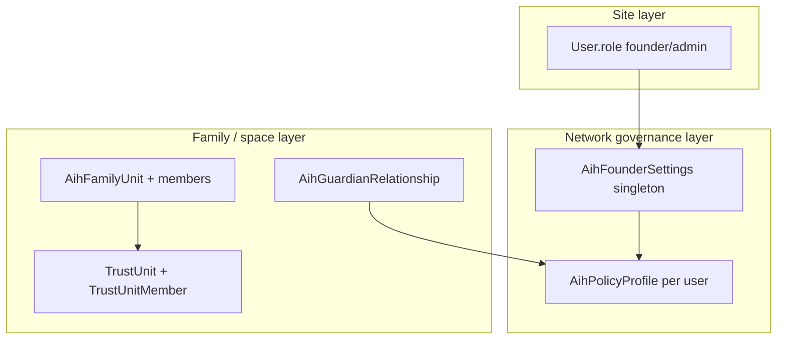

# Founder / Steward Assignment Model

**Agent 72 deliverable** — documents how authority is assigned today and how it should be separated. **No implementation.**

---

## Terminology (product vs database)

| Product term | Often confused with | Actual storage today |
|--------------|---------------------|----------------------|
| **Site founder** | First network member | `User.role = "founder"` |
| **Site admin** | Founder in UI | `User.role = "admin"` |
| **Family steward** | Site founder | No column — UI copy for founder/admin shell |
| **Guardian** | Sponsor | `AihGuardianRelationship` |
| **Sponsor** | Founder | `User.invitedById` + `ConnectionRequest` |
| **Network Msg Rules editor** | Per-family founder | `AihFounderSettings` singleton |

---

## Three authority layers

---

## Site founder (`User.role`)

### Assignment today

| Event | `User.role` |
|-------|-------------|
| First user registers (no invite) | `founder` |
| Invite registration | **`member`** always |
| Admin promotes user | `admin` (separate tooling) |

**Source:** `app/api/auth/register/route.ts` lines 70–72.

### Powers today

- Family Safe **founder shell** (`deriveShellMode` → `"founder"`)  
- Site `/admin` (with `admin`)  
- `PATCH /api/aihsafe/founder-settings`  
- Create family/trust units (subject to governance)  

### Scope

**Global** — one role per user for the whole deployment, not per family unit.

---

## Network governance founder (`AihFounderSettings`)

### Model

- Table: `aih_founder_settings`  
- Typically one row (`id: "singleton"`)  
- `founderUserId`: **audit string** of last editor — not a foreign key, not authorization  

### Powers

Network-wide defaults: minor posting, trusted adults, private threads, default visibility, etc.  
Merged into every user’s `ResolvedPolicyProfile` via `resolvePolicyProfile()`.

### Scope

**Global singleton** — not per `AihFamilyUnit` or per `TrustUnit`.

**Gap:** A second family on the same deployment cannot have different Msg Rules stewards without a schema split (e.g. `familyUnitId` on settings or policy scope).

---

## Family steward (product concept)

### Intended meaning

The adult who **governs** a child’s Boundaries, guardian approvals, and family spaces — e.g. Spencer for Jane.

### Today

| Mechanism | Steward? |
|-----------|----------|
| Invite with `relationship: "parent"` | **No** — label only |
| `User.invitedById` | Sponsor tree only |
| `AihGuardianRelationship` kind `parent` | **Yes** — governance escalation target |
| `AihFamilyUnitMember` role `guardian` | **Yes** — family unit scope |
| `User.role = founder` | Site-wide, not per child |

**Child invite does not auto-create steward link.** Seed data (`scripts/aihsafe/seed-relationship-scenarios.ts`) creates guardian links and family units **manually**, not via invite API.

### Recommended model (future)

| Field / row | Purpose |
|-------------|---------|
| `Invite.stewardUserId` | Declared steward at send time |
| `Invite.guardianDeclaration` | Legal attestation timestamp |
| `AihGuardianRelationship` | Materialized on child register |
| `AihFamilyUnit.stewardUserId` or member role | Scoped Msg Rules editor for that unit |
| **Not** `User.role = founder` | Avoid conflating site admin with parent |

---

## Sponsor vs steward vs founder

| Role | Question answered | Created by invite today? |
|------|-------------------|---------------------------|
| **Sponsor** | Who invited you into the network? | Yes — `invitedById`, bond |
| **Steward** | Who governs your family Boundaries? | No — manual guardian link / seed |
| **Founder (site)** | Who runs the whole AMIHUMAN.NET site? | Only user #1 |
| **Founder (network settings)** | Who edits global Msg Rules? | Site founder/admin |

**Adult friend invite:** sponsor only — **correct**.  
**Parent → child invite:** should be sponsor **and** steward — **incomplete**.

---

## Guardian assignment

### Creation path

`POST /api/aihsafe/guardian-links` only — requires active child user, governance `canLinkGuardian`, founder settings for `trusted_adult`.

### Not created by

- `POST /api/invite`  
- `POST /api/auth/register`  
- `executeDeferredAction` `invite_member`  
- Identity challenge acceptance  

### Kinds

`parent`, `grandparent`, `legal_guardian`, `trusted_adult` with `permissionLevel` `view_only` | `approver` | `full_control`.

---

## Trust unit / business authority

### Membership

`TrustUnitMember` — flat membership; role lives in `AihTrustUnitMeta` / request flows, not on invite.

### Business steward

No `business_admin` on invite. Creating a BUSINESS vault space (`vaultSpaceType: BUSINESS`) does not assign CFO/CEO roles to invitees.

**Recommendation:** `organizationRole` on invite + `TrustUnitMemberRole` enum at accept.

---

## Founder scoping options (future design)

| Option | Pros | Cons |
|--------|------|------|
| A. Keep site `User.role` only | Simple | Cannot have two family stewards with different rule sets |
| B. `AihFamilyUnit.stewardUserId` | Per-family Msg Rules | Migration + UI per unit |
| C. Guardian `full_control` = steward | Reuses graph | Blurs trusted adult vs parent |
| D. `Invite.stewardUserId` + policy scope | Explicit at invite | Requires intent model |

**Agent 72 recommendation:** **B + D** — declare steward on invite, persist family unit steward, keep site `founder` for platform operators only.

---

## Assignment decision table (target)

| Scenario | Site `User.role` | Network settings editor | Guardian link | TU org role |
|----------|------------------|-------------------------|---------------|-------------|
| Spencer invites Bill (friend) | member | — | — | — |
| Spencer invites Jane (child, parent attested) | member | Spencer per family unit | Spencer parent/approver | optional |
| CEO invites CFO | member | — | — | `cfo` on BUSINESS TU |
| First bootstrap user | founder | founder | — | — |

---

## Invariants (enforce in future agents)

1. `User.role = founder` **only** for site bootstrap or admin promotion — never invite side-effect.  
2. `relationship: "parent"` **requires** `inviteIntent` in (`child`, `teen`) + `guardianDeclaration`.  
3. Business intents **must not** insert `AihGuardianRelationship`.  
4. Child registration **must** apply minor policy before any post/invite capability.  
5. Unknown DOB on child intent **must fail** or force guardian-verified DOB entry.  

---

## Code references

| Topic | Location |
|-------|----------|
| Role at register | `app/api/auth/register/route.ts` |
| Shell mode | `components/aihsafe/roles/shellMode.ts` |
| Founder settings | `prisma/schema.prisma` → `AihFounderSettings` |
| Guardian links | `app/api/aihsafe/guardian-links/route.ts` |
| Policy merge | `lib/aihsafe/policy/resolvePolicyProfile.ts` |
| Governance invite | `lib/aihsafe/governance/index.ts` → `canInviteToTrustUnit` |
