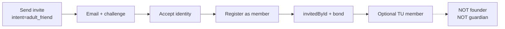
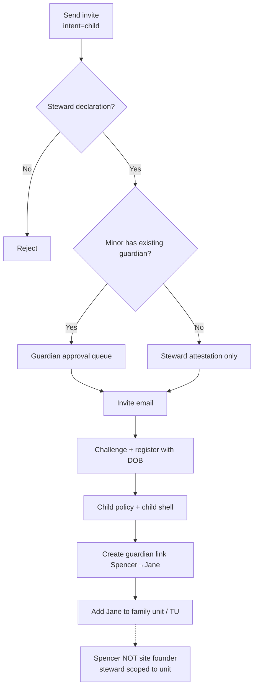
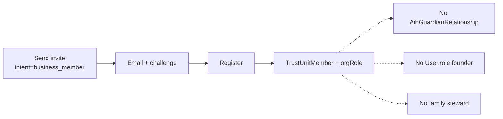

# Invite Intent Routing Map

**Agent 72 deliverable** — recommended future routing. **Not implemented.**

This map separates **what happens today** (solid lines) from **what should happen** (dashed) once `inviteIntent` exists.

---

## Intent → entry point

| Intent | Send API (future) | Send API (today) | Pre-send gates |
|--------|-------------------|------------------|----------------|
| `adult_friend` | `POST /api/invites` (unified) | `POST /api/invite` | Recipient not member; optional TU id |
| `family_adult` | unified | `POST /api/invite` or AIH with `familyUnitId` | Family/TU membership check |
| `trusted_adult` | unified | Manual guardian link after register | Founder `enableTrustedAdults`; child exists |
| `child` | unified + declaration | AIH only if minor known/hinted | Guardian declaration; steward id; minor age bracket |
| `teen` | unified + declaration | Same as child | Same; teen policy preview |
| `business_member` | unified | `POST /api/invite` (no org role) | Actor member of `targetTrustUnitId`; BUSINESS vault |
| `business_admin` | unified | — | TU admin permission |
| `org_role` | unified | — | Role template on TU |

---

## Flow diagrams

### Adult friend (Spencer → Bill)



**Today:** Steps A–E work via `POST /api/invite`. F only if auto-TU proposal fired. G satisfied.

---

### Child / family (Spencer parent → Jane, 12)



**Today:** F–H partial (no declaration, no I–J auto). Spencer gets bond + `invitedById` only if Jane completes register; guardian link manual.

---

### Business (CEO → CFO)



**Today:** Same as adult friend; BUSINESS `TrustUnit` must be created separately; CFO not auto-added to CEO’s TU from invite.

---

## Acceptance → side effects matrix (target state)

| Intent | invitedById | Bond | Guardian link | Family unit | Trust unit | User.role | Policy profile |
|--------|-------------|------|---------------|-------------|------------|-----------|----------------|
| adult_friend | ✓ | ✓ | — | — | optional | member | adult |
| family_adult | ✓ | ✓ | — | optional | optional | member | adult |
| trusted_adult | ✓ | ✓ | trusted_adult | — | — | member | per child |
| child | ✓ | ✓ | parent/steward | ✓ | optional | member | child |
| teen | ✓ | ✓ | parent/steward | ✓ | optional | member | teen |
| business_* | ✓ | optional | — | — | ✓ | member | adult |
| org_role | ✓ | optional | — | — | ✓ + role | member | adult |

---

## API unification recommendation

```
POST /api/invites
  body: { inviteIntent, recipientEmail, ...intentSpecific }
       ↓
  lib/aihsafe/invites/routeByIntent()
       ├─ adult_friend / family_adult → createInvite + audit
       ├─ child / teen → sendChildInvite OR steward path + declaration store
       ├─ business_* → createInvite + persist targetTrustUnitId + organizationRole
       └─ return { inviteId, state, approvalRequestId? }
```

**Deprecate** dual paths:

- `POST /api/invite` → thin wrapper or 308 to unified route  
- `POST /api/aihsafe/invites` → merge into unified route  

Keep **identity challenge** at `GET|POST /api/invite/[token]` (stable public URLs).

---

## Registration hook (target)

```
POST /api/auth/register
  ...
  materializeInviteOutcome(user, invite):
    switch (invite.inviteIntent)
      case child|teen: ensureGuardianLink(steward, user); ensureFamilyMembership(...)
      case business_*: ensureTrustUnitMember(invite.targetTrustUnitId, role)
      case adult_friend: ensureBond only
```

**Today:** inline bond + `ensurePolicyProfile` only.

---

## Escalation matrix (minors)

| Actor | Target | Today | Target |
|-------|--------|-------|--------|
| Adult | Adult | Allow (`POST /api/invite`) | Allow |
| Adult | Minor (known) | AIH: guardian approval | Allow after approval + declaration |
| Adult | Minor (unknown email) | Legacy path: no gate | Require age bracket + declaration at send |
| Minor | Anyone | Denied (governance) | Denied |
| Business admin | Adult employee | Same as adult | TU-scoped only |

---

## UI route map (invite modal steps)

| Step | adult_friend | child | business_member |
|------|--------------|-------|-----------------|
| 1 Email | ✓ | ✓ | ✓ |
| 2 Relationship | Frnd / Other | Parent / Guardian path | Org role picker |
| 3 Declaration | — | Steward attestation | — |
| 4 Policy preview | Optional | Boundaries preview | Workspace rules |
| 5 Send | `adult_friend` | `child` + escalation | `business_member` |

---

## Files to touch (future agents — not Agent 72)

| Layer | Files |
|-------|--------|
| Schema | `prisma/schema.prisma` (`Invite` extensions) |
| Service | `lib/aihsafe/invites/routeByIntent.ts`, `lib/invite/index.ts` |
| Register | `app/api/auth/register/route.ts` |
| API | Unified `app/api/invites/route.ts` |
| UI | `app/(app)/invite/InviteClient.tsx` |
| Verify | `scripts/aihsafe/verify-invite-intent-routing.ts` |
