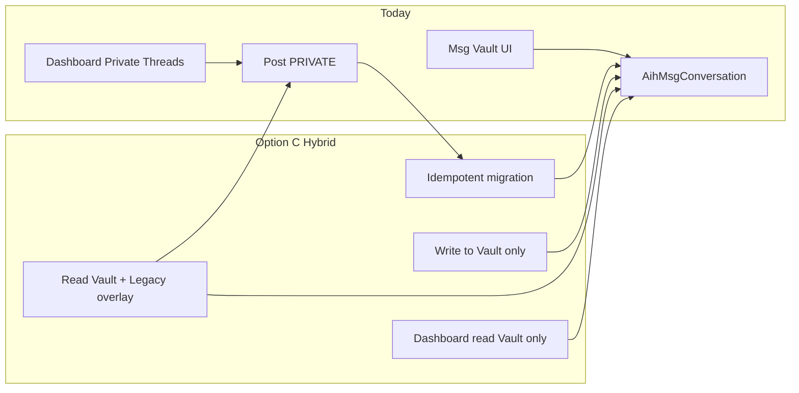

# Dashboard ↔ Msg Vault Convergence Roadmap

**Agent:** 58 — Thread Data Convergence Plan  
**Status:** Execution roadmap (agents 59–63+)

---

## Goal

One backend for private conversations. Dashboard and Msg Vault remain **two UIs** over the **same APIs and tables**.

---

## Phase diagram



---

## Phase 0 — Prerequisites (complete)

| Item | Status |
|------|--------|
| Msg Vault schema (Agent 49) | Done |
| Msg Vault APIs (Agent 50) | Done |
| UI selector model (Agent 57) | Done |
| `directKey` = `directThreadKey` | Done |

---

## Phase 1 — Agent 59: Schema / provenance (if approved)

**Branch:** `aihsafe-agent-59-vault-migration-schema`

| Change | Purpose |
|--------|---------|
| `AihMsgMessage.migratedFromPostId String? @unique` | Idempotent post import |
| Optional `AihMsgConversation.legacyThreadKey String?` | Debug + bridge lookup |
| Optional `Post.vaultMigratedAt DateTime?` | Mark legacy rows processed |

No UI. Migration script can be written against new fields.

---

## Phase 2 — Agent 60: Migration dry-run

**Branch:** `aihsafe-agent-60-private-post-migration-dry-run`

Deliverables:

- CLI/script: `npm run migrate:private-posts -- --dry-run`
- Report: threads found, messages would create, quarantine (ungoverned pairs)
- JSON export for founder review
- Zero writes in dry-run mode

Exit criteria: Stakeholder sign-off on counts and quarantine policy.

---

## Phase 3 — Agent 61: Dashboard read/write switch

**Branch:** `aihsafe-agent-61-dashboard-vault-private-threads`

| Area | Work |
|------|------|
| Feature flag | `PRIVATE_THREADS_USE_VAULT=true` |
| Read | Replace `getPrivateFeedPosts` path with vault client fetch |
| Selector | Map `conversationId`; resolve peer click → `createDirectConversation` |
| Write | `DashboardPrivateThreadCenter` → `sendVaultMessage` |
| Unread | Use participant `lastReadAt` from vault |
| Bridge | During flag: show legacy overlay for unmigrated threads only |

Exit criteria: New messages appear in Msg Vault; dashboard shows same thread as `/msg-vault` for same pair.

---

## Phase 4 — Agent 62: Legacy removal

**Branch:** `aihsafe-agent-62-remove-legacy-private-posts`

| Area | Work |
|------|------|
| `app/api/profile/posts` | Reject `scope: PRIVATE` with clear error + link to vault |
| `getPrivateFeedPosts` | Remove or restrict to admin archive tool |
| `buildPrivateThreads` | Delete or move to `scripts/` only |
| `/family-vault/private` | Redirect to dashboard private tab or msg-vault |
| Comments | Document that comment-on-private-post is deprecated |

Exit criteria: No production code path creates PRIVATE posts.

---

## Phase 5 — Agent 63: QA / security pass

**Branch:** `aihsafe-agent-63-vault-convergence-qa`

Checklist:

- [ ] Re-run migration twice — no duplicate messages
- [ ] Child cannot message stranger via dashboard or vault
- [ ] TU non-member cannot read thread
- [ ] `enablePrivateThreads: false` blocks new thread, read still works
- [ ] Deleted post handling documented
- [ ] Unread badges consistent across dashboard + vault
- [ ] Load test: 500-message thread pagination

---

## API contract (dashboard consumer)

Dashboard should depend only on:

```
GET  /api/msg-vault/conversations
POST /api/msg-vault/conversations          # create direct (peerUserId)
GET  /api/msg-vault/conversations/[id]
GET  /api/msg-vault/conversations/[id]/messages
POST /api/msg-vault/conversations/[id]/messages
POST /api/msg-vault/conversations/[id]/read  # future: mark read (Agent 59+)
```

Optional compact DTO for dashboard (same routes, query `?compact=1`) — avoid duplicating business logic in RSC.

---

## Feature flags

| Flag | Phase | Effect |
|------|-------|--------|
| `PRIVATE_THREADS_USE_VAULT` | 61 | Dashboard uses vault APIs |
| `PRIVATE_THREADS_LEGACY_READ` | 61–62 | Show unmigrated post overlay |
| `PRIVATE_THREADS_BLOCK_LEGACY_WRITE` | 61 | Block PRIVATE post create |

Remove flags after Phase 62 stable in production.

---

## Success metrics

- Zero new `Post.scope = PRIVATE` rows after cutover week
- 100% of active private threads visible in Msg Vault
- Dashboard ↔ vault message parity for same `conversationId`
- No user-reported "missing history" after migration
- `canMessage` denial rate stable (no spike from migration)

---

## Out of scope (later agents)

- Comment/like migration from private posts
- Message attachments / video
- Guardian read-all-child-messages API
- Full-text search across vault
- E2E encryption
