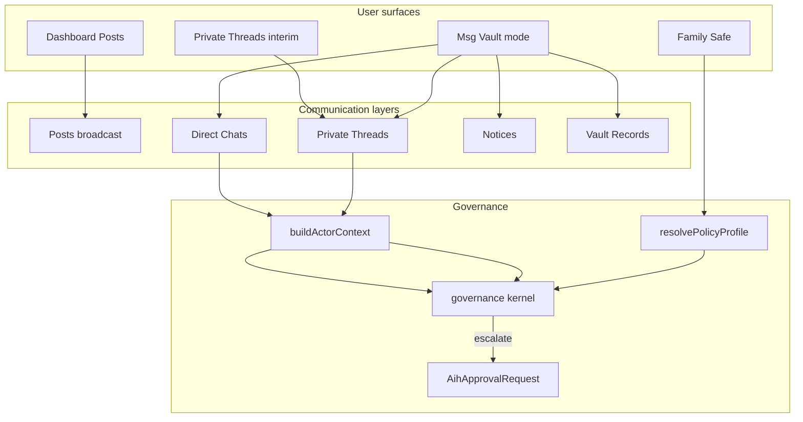

# Msg Vault — Governed Communication Architecture

**Agent:** 48 — Msg Vault Governed Communication Architecture  
**Branch:** `aihsafe-agent-48-msg-vault-architecture`  
**Date:** 2026-05-19  
**Status:** Planning / architecture only — no product code, schema, APIs, or UI in this pass.

---

## Executive summary

Msg Vault is a **governed communication mode** inside AMIHUMAN.NET — not a generic chat product and not a duplicate of the member dashboard. It coordinates **who may talk to whom, under what relationship, with what oversight**, across direct chats, private threads, group rooms, and system notices.

Today the product **labels** `/aihsafe` as “Msg Vault” but renders the **Family Safe governance shell** (`FounderShell`). Dashboard **Private Threads** are implemented as scoped `Post` rows (`scope: PRIVATE` + `PostVisibility`). This document defines the **target architecture** so future agents can split concerns cleanly without becoming Discord, Slack, or open DMs.

**Prerequisite reading:** Agents 36–46 policy/governance reports (`docs/aihsafe/agent-36-policy-profile-audit.md` through `agent-46-minor-policy-qa-report.md`).

---

## 1. What is Msg Vault?

### Definition (mode / environment)

**Msg Vault** is an authenticated **communication environment** where every channel is:

1. **Relationship-grounded** — participants share a family edge, trust unit, guardian link, or org hierarchy edge before messaging is allowed.
2. **Policy-governed** — `resolvePolicyProfile()` + governance kernel (`canMessage`, `canPostContent`, escalation) decide allow / deny / escalate before content is stored.
3. **Explainable** — users see *why* they can see a thread, who can read it, and what approvals are pending (governance overlays).
4. **Role-aware** — navigation and affordances differ for founder/parent, guardian/manager, adult member, and child/teen without changing server enforcement.

Msg Vault is entered as a **dedicated route group** (proposed: `/msg-vault/*`) with **internal tabs only** — not new global sidebar items for every sub-feature.

### What Msg Vault is not

| Anti-pattern | Why excluded |
|---|---|
| Discord / Slack clone | No open servers, @everyone, bot integrations, or public channels |
| Public social messaging | No stranger discovery, hashtags, or algorithmic ranking |
| Open DMs | No “message anyone on the network” |
| Algorithmic feed | No engagement-optimized timeline inside the vault |
| Replacement for Family Safe admin | Governance configuration stays in Family Safe; Msg Vault *consumes* policy |

---

## 2. Four surfaces — keep them separate

| Surface | Primary job | Primary user | Data today | Target home |
|---|---|---|---|---|
| **Dashboard Posts** | Family/network **broadcast** — scoped posts visible on the member dashboard feed | All members | `Post` + `dashboardFeedWhere` | Stays on `/dashboard` (Posts tab) |
| **Private Threads** | **Governed group / 1:1 conversations** tied to trust units or explicit visibility sets | Members with trust bonds | `Post` `scope: PRIVATE` + `PostVisibility`; `PrivateFeedClient` | **Migrates into** Msg Vault → **Threads** + **Chats** (with native `Conversation` model later) |
| **Msg Vault** | **Unified communication hub** — chats, threads, notices, people, spaces, settings | All roles (nav varies) | `/aihsafe` page title only; shell is governance UI | `/msg-vault/*` dedicated shell |
| **Family Safe** | **Policy & structure** — founder settings, guardian links, family units, trust units, activity governance, approvals inbox | Founder / guardian / child (shell modes) | `app/(app)/aihsafe`, `lib/aihsafe/*`, `Aih*` models | Stays at `/aihsafe` (rename UX label back to “Family Safe” when Msg Vault route exists) |

### Naming collision (current vs target)

| Today | Problem | Target |
|---|---|---|
| `app/(app)/aihsafe/page.tsx` metadata: `"Msg Vault"` | Users expect messaging; get governance tabs | Rename page title to **Family Safe** |
| `DashboardVaultTabs` link `MSG_VAULT_HREF = "/aihsafe"` | Dashboard “Msg Vault” tab opens governance | Link to `/msg-vault` |
| `getVaultNotificationCount()` | Counts trust/approval/invite signals, not messages | Extend with unread messages + pending notices |

### Responsibility split (one sentence each)

- **Dashboard** — “What’s happening in my family network?” (metrics, feed, shallow entry to vault).
- **Private Threads (interim)** — “Continue a governed conversation” until Msg Vault MVP ships; then dashboard links deep-link into vault.
- **Msg Vault** — “Talk, coordinate, and respond to governance events in one governed place.”
- **Family Safe** — “Configure and audit who is allowed to do what.”

---

## 3. Communication layers (summary)

See `communication-layer-map.md` for full layer definitions.

| Layer | Intent |
|---|---|
| **Posts** | Broadcast to family / space / trust visibility |
| **Private Threads** | Multi-party governed rooms (trust unit or custom participant set) |
| **Direct Chats** | 1:1 quick coordination on an existing relationship edge |
| **Notices** | Approvals, invites, policy events, membership changes — not free-form chat |
| **Vault Records** | Immutable / archival trust & governance artifacts (audit, resolved approvals) |

---

## 4. Internal Msg Vault navigation

**Principle:** Submenu **inside** Msg Vault only. Do not expand `AppShell` with Chats / Threads / Notices as top-level items.

### Proposed tabs

| Tab | Purpose |
|---|---|
| **Overview** | At-a-glance: unread, pending approvals, active spaces, recent notices |
| **Chats** | 1:1 direct conversations (relationship-gated) |
| **Threads** | Group / trust-unit / custom participant threads |
| **Notices** | Approval queue, invites, policy & status events |
| **People** | Relationship-scoped directory (tree + trust + guardians) — not global search |
| **Spaces** | Msg Vault spaces (maps to `AihTrustUnitMeta.vaultSpaceType` + `TrustUnit`) |
| **Settings** | Per-user comm preferences + links to Family Safe for policy |

### Role-aware visibility

| Role bucket | Tabs |
|---|---|
| **Founder / Parent / CEO** (network or org steward) | Overview, Chats, Threads, Notices, People, Spaces, Settings |
| **Guardian / Manager** | Overview, Chats, Threads, Notices, People, Spaces |
| **Member / Adult** | Chats, Threads, Notices, People |
| **Child / Teen** | Chats, **Approved Threads**, Notices (read-only where applicable) |

**Shell mapping:** Reuse `deriveShellMode()` (`founder` | `member` | `child`) plus `isGuardian` for manager surfaces. Add optional **org mode** later (`business` shell) for CEO → CFO hierarchy without new security primitives — hierarchy comes from `DashboardSpace` / future `OrgRole` edges.

### Child / teen constraints (nav)

- **Threads** tab lists only threads the child is a member of **and** that are not blocked by policy (guardian-approved join, or auto-approved family thread).
- **Chats** lists only peers allowed by `canMessage()` (guardian, co-trust-unit, approved edge).
- No **Settings** tab for minors — guardian-controlled via Family Safe.

---

## 5. Core objects (conceptual)

Detailed field-level sketches live in this section; **no Prisma implementation** in Agent 48.

| Object | Role |
|---|---|
| `MsgVaultSpace` | A governed container (family, business pod, club, church, private) — aligns with `AihTrustUnitMeta.vaultSpaceType` + `TrustUnit` |
| `Conversation` | A thread of messages (direct, group, or space-scoped) |
| `ConversationParticipant` | Membership, role, mute, joinedAt, leftAt |
| `Message` | Atomic unit of content (text first; attachments later) |
| `MessageAttachment` | Future binary metadata (governed upload) |
| `Notice` | System-generated event record (approval, invite, policy, membership) |
| `GovernanceOverlay` | UI + API bundle: why visible, who can read, pending escalation |
| `RelationshipContext` | Edges: guardian, invitedBy, trust unit, org role — drives gates |
| `ReadReceipt` / `Acknowledgement` | Seen state; minors may expose summarized acks to guardians |
| `EscalationEvent` | Links to `AihApprovalRequest` / deferred actions |

**Interim bridge:** Existing `Post`-based private threads map to `Conversation` with `legacyPostId` until migration agent runs.

---

## 6. Governance integration

Msg Vault **must call** (future routes):

1. `buildActorContext(userId)` — graph snapshot  
2. `resolvePolicyProfile(userId)` — founder + per-user policy  
3. `canMessage()` / future `canJoinConversation()` / `canCreateThread()` — kernel gates  
4. Escalation → `AihApprovalRequest` + `executeDeferredAction` (same pattern as `activity.post_pending`)

Founder settings already persisted (`enablePrivateThreads`, `enableTrustedAdults`, minor posting flags) — Msg Vault enforces them at **conversation create** and **message send**, not only at post compose.

See `governance-rules.md`.

---

## 7. Right-side context rail

Msg Vault uses a **dynamic context rail** (same UX pattern as `DashboardContextRail` + `ContextRailCard`) that changes with the active conversation / space / notice.

See `context-rail-model.md`.

---

## 8. Indicators & “alive” signals

| Signal | Source (current / future) |
|---|---|
| Unread message count | Future: `Message` read cursors |
| Pending approval count | `AihApprovalRequest` where `approverId = me` |
| New reply in thread | Conversation last activity > last read |
| Child request pending | Escalations mine (`/api/aihsafe/escalations/mine`) |
| Invite accepted | `Invite` status + notices |
| Post awaiting review | Guardian inbox `activity.post_pending` |
| Policy change notice | `FOUNDER_SETTINGS_UPDATED` audit → Notice |
| Member joined / left | Trust unit / space membership events |
| Restricted action blocked | Governance deny with `ReasonCode` → Notice |

`getVaultNotificationCount()` should evolve into a **structured badge model** (not a single integer) feeding Overview + sidebar.

---

## 9. Current codebase map (inspected)

| Area | Finding |
|---|---|
| `app/(app)/msg-vault/*` | **Does not exist** |
| `components/msg-vault/*` | **Does not exist** |
| `app/(app)/aihsafe/page.tsx` | Renders `FounderShell`; metadata title “Msg Vault” |
| `components/dashboard/DashboardVaultTabs.tsx` | Posts / Private Threads / My Posts / Invites; Msg Vault → `/aihsafe` |
| `components/dashboard/DashboardContextRail.tsx` | Family tree shortcuts → open private thread on dashboard |
| `components/PrivateFeedClient.tsx` | Thread UX over `Post` model (direct / TU / group) |
| `lib/aihsafe/governance/index.ts` | `canMessage()` implemented |
| `lib/aihsafe/policy/*` | `resolvePolicyProfile`, founder settings merge |
| `prisma/schema.prisma` | `Post`, `PostVisibility`, `TrustUnit`, `AihTrustUnitMeta`, `AihApprovalRequest`, `AihFounderSettings.enablePrivateThreads` |
| `lib/dashboard/vault-notification-count.ts` | Trust + approvals + TU invites; `unreadVaultMessages = 0` placeholder |

---

## 10. Architecture diagram (target)

---

## 11. Related documents

| Document | Contents |
|---|---|
| `communication-layer-map.md` | Layer boundaries and migration from `Post` |
| `governance-rules.md` | Hard rules and policy matrix |
| `context-rail-model.md` | Right-rail dynamic panels |
| `mvp-build-plan.md` | Agent sequence and explicit non-goals |
