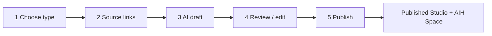

# Studio Builder Flow

**Status:** Architecture target (Agent 93)  
**Principle:** Input sources → AI extraction → Studio draft → human review → publish.  
**Not built end-to-end today** — `/studios/start` remains an editor prototype with `localStorage` drafts.

---

## Relationship to existing surfaces

| Surface | Today | After builder |
|---------|-------|---------------|
| `/studios/start` | `StudioEditor` + neutral template + profile hydration | **Wizard shell** (Agents 95–98) — same route, additive steps |
| `/studios/[slug]` | Public preview (`TrainerStudioShell` live) | Unchanged publish target |
| Family Safe → Spaces | CTA → `/studios/start` | Same entry; post-publish links Space ↔ Studio |
| Preview / publish controls | `ApplyStudioHero`, `studioViewMode` | **Preserved** — wizard writes draft JSON; publish still requires steward approval |

See [studios-as-published-spaces.md](./studios-as-published-spaces.md) and [studio-creation-flow.md](./studio-creation-flow.md).

---

## Five-step wizard (canonical)



### Step 1 — Choose Studio Type

User picks one **template lens** (maps to hero triad + default sections):

| UI label | Template id | Maps to hero triad |
|----------|-------------|-------------------|
| Private Member Network | `private-studio-network` | `studio-network` |
| Private Client Network | `private-client-network` | `client-network` |
| Family & Learning Space | `family-learning` | `family-learning` |
| Executive / Work Space | `executive-work` | (extends neutral — strategy tone) |
| Community Group | `local-community` | church / PTA / club |
| Gap U / Learning Lab | `gap-u-learning-lab` | family-learning variant — see [gap-u-learning-lab-template.md](./gap-u-learning-lab-template.md) |

- Selection sets `StudioDraft.templateType`, default copy style, section visibility, and Msg Rules **presets** (documented in [studio-template-gallery.md](./studio-template-gallery.md)).
- User may change template in Step 4; AI may suggest a better fit in Step 3 (`suggestedTemplateType`).

### Step 2 — Add Source Links

User adds **public URLs only** (no credentials, no private scraping):

- Instagram, website, booking page, GlossGenius, Vagaro, Square, YouTube, Facebook, Google Business Profile, LinkedIn
- Optional label + user notes per link
- Logo / image / video uploads deferred to Step 4 (or post-MVP upload step) — not required to proceed

Normalized model: [studio-source-intake-model.md](./studio-source-intake-model.md).

**MVP extraction (Agents 96–97):** manual paste + optional **stub/mock** extractor that returns structured placeholders from URL hostname/path — not headless browser, not paid enrichment APIs.

### Step 3 — AI Draft

System runs extraction + generation into `StudioDraft` ([studio-ai-draft-model.md](./studio-ai-draft-model.md)).

**Extract (from public signals + profile hydration):**

- Identity: name, category, tone, audience, location
- Services/programs, offers, media references, social proof
- Contact/location hints (flagged for confirmation)
- Best-fit template + suggested sections

**Generate:**

- Hero copy, 3-card positioning, Why Studios, How it works
- Service/program cards, intro video script, invite message, first post, request-access copy

**Rules:**

- Draft status only — never auto-publish
- Low-confidence fields → `confidenceWarnings`
- No scraped claims promoted to publish without Step 4 approval

### Step 4 — Review / Edit

Steward can:

| Action | Behavior |
|--------|----------|
| Approve draft | Marks section or whole draft `approved` |
| Edit sections | Inline in existing editor modules where possible |
| Regenerate section | Re-run AI for one module; keeps other approved sections |
| Replace media | Upload or URL; uses existing storage conventions |
| Hide section | `visible: false` in draft JSON |
| Change template | Re-applies gallery defaults; user confirms overwrite |
| Save draft | Persist `StudioBuilderSession` (Agent 94 schema) — replaces sole reliance on `localStorage` for builder path |

Contact and location fields require explicit **confirm** checkbox before publish eligibility.

### Step 5 — Publish

On publish (extends existing preview/publish UX, does not replace it):

1. Validate: draft approved, contact/location confirmed, slug available
2. Create or link **governed AIH Space** (TrustUnit or FamilyUnit per template)
3. Persist **Published Studio** (`Studio` row + presentation JSON / future `studio.spaceId`)
4. Enable public preview per `publicEnabled`
5. Provision defaults:
   - Default **private member** scope under Space
   - **Msg Vault** thread/conversation stub for steward welcome (not a Studio inbox)
   - **Request access / invite** CTA → `POST /api/invite` with space scope (no parallel Studio invite)

Member access always via AIH invite graph — see [studio-aih-boundary-map.md](./studio-aih-boundary-map.md).

---

## State machine (builder session)

```text
INTAKE_TYPE_SELECTED
  → SOURCES_COLLECTED
  → EXTRACTION_PENDING | EXTRACTION_PARTIAL | EXTRACTION_FAILED
  → DRAFT_READY
  → IN_REVIEW
  → READY_TO_PUBLISH
  → PUBLISHED
```

Failures in extraction do not block manual edit: user can skip AI and fill Step 4 from template defaults + profile hydration (today’s behavior).

---

## What we do not build in this flow

- Full scraping, headless browsers, or platform login
- Paid third-party enrichment APIs
- Parallel AIH identity or invite tokens
- Studio-only messaging or member tables

---

## Agent ownership (implementation)

| Agent | Deliverable |
|-------|-------------|
| 94 | Schema + TypeScript contracts (`StudioSourceInput`, `StudioDraft`, `StudioBuilderSession`) |
| 95 | Wizard shell routes/stepper on `/studios/start` |
| 96 | Source link intake UI + draft persistence |
| 97 | AI draft generator stub/mock |
| 98 | Review/edit screen wired to draft model |
| 99 | Publish → Space + `Studio` integration |
| 100 | QA / security pass |

---

## Related docs

- [studio-template-gallery.md](./studio-template-gallery.md)
- [studio-source-intake-model.md](./studio-source-intake-model.md)
- [studio-ai-draft-model.md](./studio-ai-draft-model.md)
- [gap-u-learning-lab-template.md](./gap-u-learning-lab-template.md)
- [agent-93-builder-intake-architecture-report.md](./agent-93-builder-intake-architecture-report.md)
